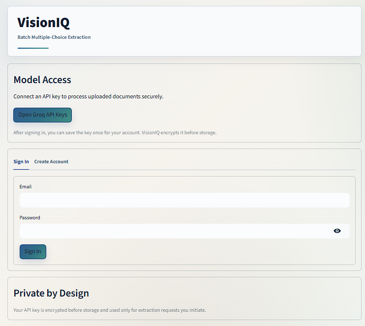
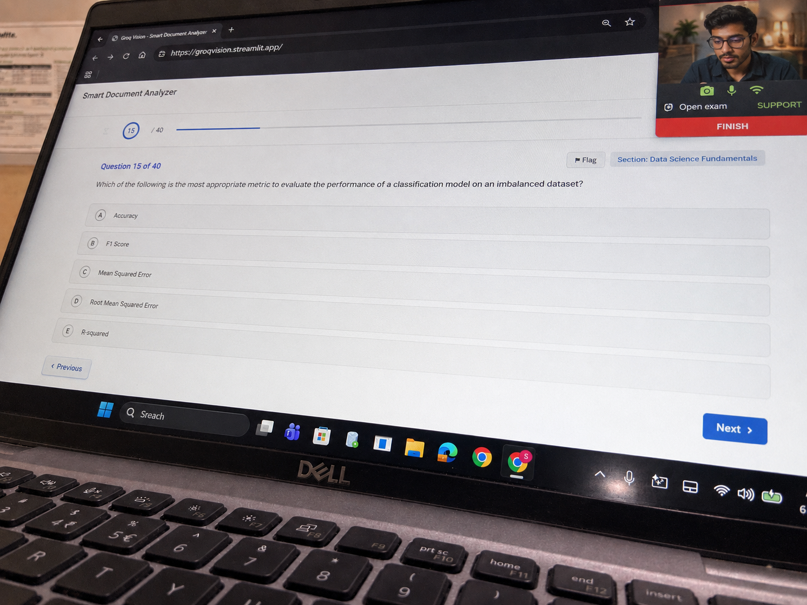
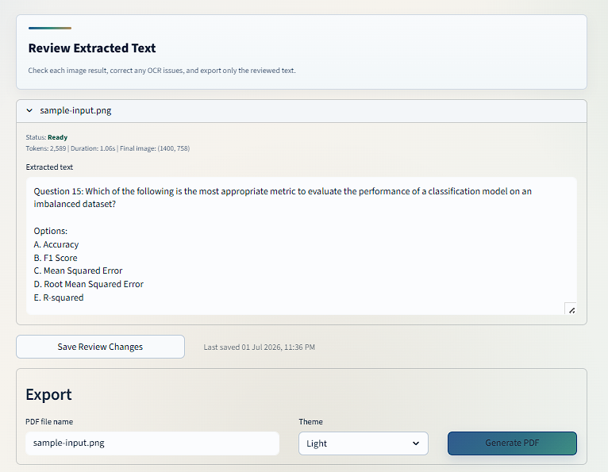
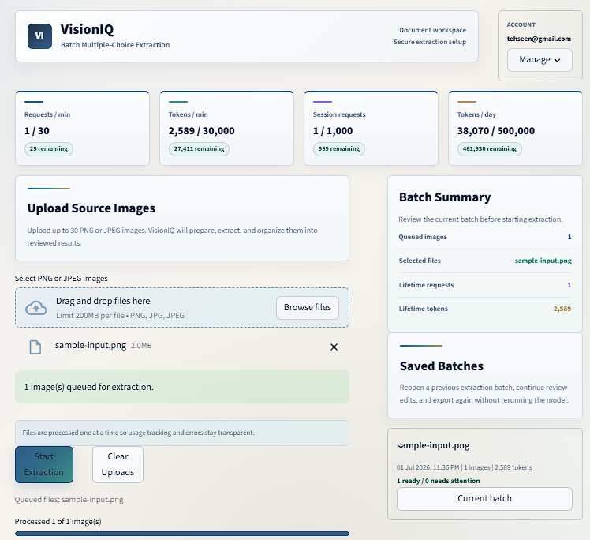

# VisionIQ

<p align="center">
  
  
  
  
  
  
  
  
</p>

<p align="center">
  <b>VisionIQ</b> is a production-oriented Streamlit application for extracting structured multiple-choice questions from screenshots and photographed computer screens using a crop-first image preparation pipeline and Groq Vision inference.
</p>

<p align="center">
  
</p>

---

## Overview

VisionIQ was built around a practical observation from real usage: for this workload, **removing irrelevant pixels often reduces token usage more effectively than compression alone**.

JPEG compression lowers byte size on disk and over the wire, but the model still receives the same visual scene if the image content remains unchanged. A photographed monitor or laptop screen typically includes:

- screen bezel
- keyboard area
- desk background
- shadows or reflections
- camera framing margins
- operating system chrome outside the useful MCQ region

Those extra regions add visual complexity without improving extraction quality. In this project, the highest-leverage optimization is to **detect the bright screen/document region first, crop to the useful area, and only then compress the remaining pixels for transport**.

That design decision drives the core preprocessing pipeline in `VisionIQ`:

1. normalize orientation and color space
2. detect the main bright region using grayscale thresholding and contour analysis
3. crop only when the detected region is large enough and safely different from the full frame
4. resize to a controlled width for model submission
5. save optimized progressive JPEG for the Groq request
6. send a strict transcription prompt to the vision model

This makes VisionIQ not just an OCR wrapper, but an **image-selection and token-efficiency pipeline** for question extraction.

---

## Product Surfaces

### Login and access setup

The application starts with a dedicated sign-in surface and API-access onboarding flow. The login screen is intentionally operational rather than marketing-oriented: users authenticate, connect model access, and move straight into the extraction workspace.

<p align="center">
  
</p>

### Sharp-angle input image

The sample below represents the kind of input VisionIQ is designed to handle well: a photographed screen from a steep angle where the useful content occupies only part of the full frame.

<p align="center">
  
</p>

### Extraction review output

After preprocessing and model extraction, VisionIQ presents the output in a review-first editor so the operator can validate and correct text before export.

<p align="center">
  
</p>

### Usage dashboard and workspace

The workspace keeps quota visibility close to the extraction controls, which is important when the application is used repeatedly for batch document processing.

<p align="center">
  
</p>

---

## Why Crop-First Matters

### Practical theory

Compression answers the question:

> How can we encode the same visual scene in fewer bytes?

Cropping answers a more important question for multimodal extraction:

> How can we remove pixels the model never needed to reason about in the first place?

For screenshots and photographed displays, a large percentage of the frame is frequently non-semantic noise relative to the extraction task. If the goal is to transcribe visible MCQs, then borders, desk surfaces, keyboard rows, and unused white margins are not helpful signal.

VisionIQ treats those areas as removable context. The cropper attempts to isolate the primary bright display region, which in typical laptop-screen captures corresponds closely to the useful content window.

### Resulting design principle

The system prefers:

- **semantic reduction first**
- **transport optimization second**

In other words:

- Crop reduces the amount of content the model needs to inspect.
- Compression reduces the size of the already-useful content being sent.

Both matter, but they solve different problems. VisionIQ is designed around the idea that **content reduction usually delivers the more meaningful token-efficiency win** for this class of images.

---

## Core Features

- Account creation and sign-in
- PBKDF2-based password hashing
- Fernet-encrypted API key storage
- Batch upload for PNG and JPEG inputs
- Crop-first image preparation pipeline
- JPEG resize and optimization for model submission
- Groq Vision extraction with a strict transcription prompt
- Request and token usage tracking
- SQLite-backed extraction history
- Reopen and edit saved extraction batches
- Light and dark PDF export themes
- Streamlit workspace with batch status and review tools

---

## System Architecture

```text
                            +----------------------+
                            |      Streamlit UI    |
                            |   src/ui.py          |
                            +----------+-----------+
                                       |
             +-------------------------+-------------------------+
             |                                                   |
             v                                                   v
  +------------------------+                         +------------------------+
  | Authentication / Keys  |                         |   Batch Orchestration  |
  | auth.py                |                         |   extraction_runner.py |
  | encryption.py          |                         +-----------+------------+
  | database.py            |                                     |
  +------------------------+                                     v
                                                       +----------------------+
                                                       |  Image Preparation   |
                                                       |  image_processor.py  |
                                                       +----------+-----------+
                                                                  |
                               +----------------------------------+----------------------------------+
                               |                                                                     |
                               v                                                                     v
                    +------------------------+                                            +------------------------+
                    | Bright-region cropper  |                                            | JPEG resize/compress  |
                    | screen_cropper.py      |                                            | image_compressor.py   |
                    +------------------------+                                            +------------------------+
                                                                  |
                                                                  v
                                                       +----------------------+
                                                       |   Groq Vision API    |
                                                       |   groq_service.py    |
                                                       +----------+-----------+
                                                                  |
                                                                  v
                                                       +----------------------+
                                                       | Persistence + Export |
                                                       | database.py          |
                                                       | usage_store.py       |
                                                       | pdf_service.py       |
                                                       +----------------------+
```

---

## Repository Layout

```text
VisionIQ/
|-- app.py
|-- README.md
|-- requirements.txt
|-- .streamlit/
|   `-- config.toml
`-- src/
    |-- auth.py
    |-- components.py
    |-- config.py
    |-- database.py
    |-- encryption.py
    |-- extraction_runner.py
    |-- file_utils.py
    |-- groq_service.py
    |-- groq_usage.py
    |-- image_compressor.py
    |-- image_processor.py
    |-- pdf_service.py
    |-- screen_cropper.py
    |-- ui.py
    `-- usage_store.py
```

---

## Extraction Pipeline

### 1. Upload staging

The UI accepts up to `30` images per batch and stages them in Streamlit session state.

Relevant defaults from `src/config.py`:

```python
MAX_IMAGES = 30
DELAY_SECONDS = 3
MAX_COMPLETION_TOKENS = 2048
IMAGE_TARGET_WIDTH = 1400
IMAGE_JPEG_QUALITY = 88
MODEL_NAME = "meta-llama/llama-4-scout-17b-16e-instruct"
```

### 2. Orientation normalization

Before any crop logic runs, VisionIQ normalizes the image:

```python
def normalize_image(image: Image.Image) -> Image.Image:
    oriented_image = ImageOps.exif_transpose(image)
    if oriented_image.mode != "RGB":
        return oriented_image.convert("RGB")
    return oriented_image
```

This matters because phone-captured images frequently store orientation in EXIF metadata instead of rotating the actual pixels.

### 3. Bright-region crop detection

The cropper is intentionally conservative. It does not attempt perspective correction or aggressive page recovery. Instead, it tries to find the dominant bright screen/document region and only accepts the crop when it is plausible.

Algorithm summary:

1. convert RGB to grayscale
2. apply Gaussian blur to reduce noisy edges
3. run Otsu thresholding
4. run morphological closing with a rectangular kernel
5. find external contours
6. choose the largest contour
7. accept only when contour area is between configured minimum and maximum ratios
8. expand by a small padding margin

Relevant code shape:

```python
_, threshold = cv2.threshold(blurred, 0, 255, cv2.THRESH_BINARY + cv2.THRESH_OTSU)
kernel = cv2.getStructuringElement(cv2.MORPH_RECT, (9, 9))
closed = cv2.morphologyEx(threshold, cv2.MORPH_CLOSE, kernel)
contours, _ = cv2.findContours(closed, cv2.RETR_EXTERNAL, cv2.CHAIN_APPROX_SIMPLE)
largest_contour = max(contours, key=cv2.contourArea)
x, y, crop_width, crop_height = cv2.boundingRect(largest_contour)
```

Crop acceptance defaults:

```python
@dataclass(frozen=True)
class CropConfig:
    min_area_ratio: float = 0.35
    padding_pixels: int = 12
    max_background_ratio: float = 0.96
```

Interpretation:

- below `0.35` of the frame, the detected region is too small to trust
- above `0.96`, the crop is effectively the full image and not worth applying
- `12` pixels of padding avoids over-trimming edge text near the boundary

For the class of inputs shown below, this is the most important preprocessing step in the system because it removes large bright but semantically irrelevant regions before the model sees the image:

<p align="center">
  
</p>

### 4. JPEG resize and compression

After cropping, VisionIQ performs a width-controlled resize and writes an optimized progressive JPEG:

```python
resized_image.save(
    final_path,
    format="JPEG",
    quality=active_config.jpeg_quality,
    optimize=True,
    progressive=True,
)
```

This stage is not the primary token-efficiency strategy. It is the transport optimization layer after semantic reduction has already happened.

### 5. Strict Groq Vision extraction

Prepared images are base64-encoded into a `data:image/jpeg;base64,...` URL and sent to Groq with a strict transcription prompt.

```python
completion = client.chat.completions.create(
    model=MODEL_NAME,
    messages=[
        {
            "role": "user",
            "content": [
                {"type": "text", "text": prompt},
                {"type": "image_url", "image_url": {"url": f"data:image/jpeg;base64,{image_b64}"}},
            ],
        }
    ],
    temperature=0,
    max_completion_tokens=max_completion_tokens,
    top_p=1,
    stream=False,
)
```

The prompt is designed to minimize hallucination and force faithful transcription:

```text
Rules:
1. Extract only text that is physically visible in the image.
2. Do not solve, infer, summarize, or complete missing text.
3. If text is unreadable, write exactly: [UNCLEAR]
4. Preserve question numbers, wording, option labels, and option order.
5. Include all visible options, including E or later options when present.
6. If the answer is visibly printed, include it. Otherwise write: Answer: Not available
7. Do not add explanations or commentary.
```

The reviewed extraction surface produced from a prepared image looks like this:

<p align="center">
  
</p>

### 6. Usage accounting and persistence

Each successful extraction updates:

- session-level usage tracker
- local daily API-key usage table
- token usage audit log
- saved extraction batch history

This makes the app usable as an operational workspace, not only a one-shot demo.

The usage dashboard is surfaced directly in the main workspace:

<p align="center">
  
</p>

---

## Image Preparation as Code

The public preparation pipeline is intentionally small:

```python
def prepare_image_for_extraction(
    input_path: str | Path,
    config: ImagePrepConfig | None = None,
) -> ImagePrepResult:
    active_config = config or ImagePrepConfig()
    source_path = str(input_path)

    with Image.open(source_path) as source_image:
        crop_result = crop_document_area(source_image, active_config.crop)
        with tempfile.NamedTemporaryFile(delete=False, suffix=".jpg") as temp_file:
            prepared_path = temp_file.name

        compression_result = save_compressed_jpeg(
            crop_result.image,
            prepared_path,
            active_config.compression,
        )

    return ImagePrepResult(...)
```

That design keeps the orchestration layer clean while exposing useful metadata:

- whether the image was cropped
- original size
- final size
- crop box
- JPEG quality

Those values are later persisted alongside extraction records for auditability.

---

## Batch Orchestration

`src/extraction_runner.py` processes images one by one instead of parallel fan-out. That choice is deliberate:

- it keeps token usage updates transparent
- it makes per-image status reporting easy
- it allows early stop on rate-limit failures
- it isolates cleanup of temporary prepared images

Core flow:

```python
for index, uploaded_file in enumerate(files, start=1):
    source_path = save_uploaded_file_to_temp(uploaded_file)
    prep_result = prepare_image_for_extraction(source_path, active_config)
    extraction = extract_questions_with_groq(...)
    record = _build_success_record(index, file_name, prep_result, extraction)
    results.append(asdict(record))
```

The runner stores both successes and failures, so the batch remains auditable even when one image fails.

---

## Persistence Model

VisionIQ uses SQLite for local persistence. The database is intentionally simple and predictable for Streamlit rerun semantics.

Main tables:

- `users`
- `token_usage`
- `extraction_jobs`
- `extraction_items`
- `api_daily_usage`

Example schema shape:

```sql
CREATE TABLE IF NOT EXISTS extraction_jobs (
    id INTEGER PRIMARY KEY AUTOINCREMENT,
    username TEXT NOT NULL,
    created_at REAL NOT NULL,
    updated_at REAL NOT NULL,
    job_name TEXT NOT NULL,
    source_count INTEGER DEFAULT 0,
    success_count INTEGER DEFAULT 0,
    error_count INTEGER DEFAULT 0,
    total_tokens INTEGER DEFAULT 0,
    model TEXT DEFAULT ''
);
```

This enables:

- saved batch history
- reopening reviewed jobs
- persistent usage summaries
- repeat PDF exports from stored results

---

## Security Notes

### Password storage

Passwords are stored using PBKDF2-HMAC-SHA256 with `160_000` iterations and per-password random salts.

### API key storage

Groq API keys are encrypted with Fernet before being stored in SQLite.

You must provide a `FERNET_KEY` through Streamlit secrets or environment variables.

Generate one:

```powershell
python -c "from cryptography.fernet import Fernet; print(Fernet.generate_key().decode())"
```

Create `.streamlit/secrets.toml`:

```toml
FERNET_KEY = "paste_generated_key_here"
```

---

## PDF Export

VisionIQ exports reviewed extraction results to PDF using ReportLab.

Supported themes:

- `Light`
- `Dark`

The dark theme is not only an accent change. It renders a dark page surface with softer text colors intended for low-glare reading.

---

## Local Development

### Requirements

- Python `3.10+`
- Groq API key
- Fernet key for encrypted local key storage

### Install

```powershell
python -m venv venv
venv\Scripts\activate
pip install -r requirements.txt
```

### Run

```powershell
streamlit run app.py
```

The app will create local data files under `VisionIQ/data/` on first use.

---

## Configuration Surface

The primary runtime constants live in `src/config.py`.

```python
APP_NAME = "VisionIQ"
APP_TAGLINE = "Batch Multiple-Choice Extraction"
MODEL_NAME = "meta-llama/llama-4-scout-17b-16e-instruct"
MAX_IMAGES = 30
DELAY_SECONDS = 3
MAX_COMPLETION_TOKENS = 2048
IMAGE_TARGET_WIDTH = 1400
IMAGE_JPEG_QUALITY = 88
RPM_LIMIT = 30
RPD_LIMIT = 1000
TPM_LIMIT = 30000
TPD_LIMIT = 500000
```

For most deployments, these are the first settings you would tune if you want different throughput, image size, or usage-monitor behavior.

---

## Package Stack

`requirements.txt` currently includes:

```text
streamlit==1.49.1
groq==0.31.0
python-dotenv==1.1.1
reportlab==4.4.3
cryptography>=45.0.0
Pillow>=11.0.0
opencv-python-headless>=4.10.0
numpy>=2.0.0
```

Rationale:

- `streamlit` for the interactive workspace
- `groq` for multimodal inference
- `opencv-python-headless` and `numpy` for region detection
- `Pillow` for normalization and JPEG processing
- `reportlab` for PDF export
- `cryptography` for secure local API-key storage
- `python-dotenv` for local environment loading

---

## Operational Notes

- Review extracted text before distributing PDFs.
- Cropping is conservative by design; when detection confidence is low, the original image is preserved.
- Usage tracking is local to the application and complements, rather than replaces, provider-side quota information.
- Saved batch history is stored locally in SQLite and is tied to the app's data directory.

---

## Production Direction

VisionIQ is structured as a production-style local application rather than a notebook or one-file prototype:

- service-oriented module boundaries
- deterministic image preparation path
- auditable batch records
- explicit usage accounting
- secure API key handling
- review-and-export workflow

The central engineering idea is straightforward:

> For photographed screens and exam content, the best first optimization is often to remove irrelevant pixels before asking the vision model to reason over the image.

That is the core thesis behind VisionIQ's preprocessing pipeline, and the rest of the system is built around making that pipeline usable in a real extraction workspace.
